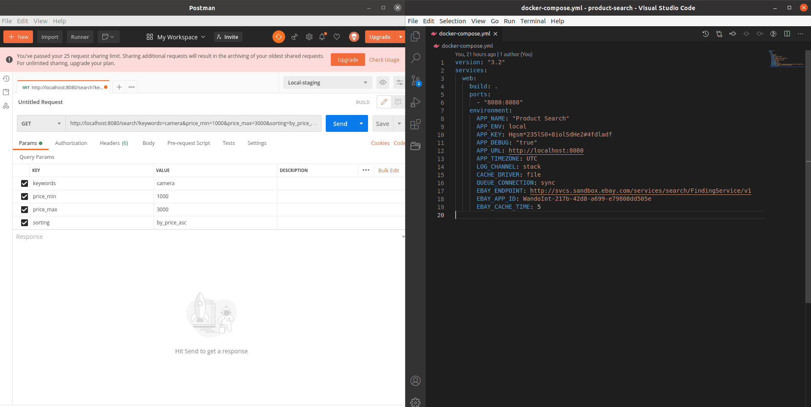

# Products Search

## Assumptions and Decisions:

- I have decided to use `Lumen` because it is a small and fast framework.
- I have used service tagging to allow multiple service providers.
- I have added caching to the request, to overcome the service response time.
- `EBAY_ENDPOINT`, `EBAY_APP_ID` and `EBAY_CACHE_TIME` are configured from environment variables to allow multiple environments creation.
- I have used simple docker and docker-compose files to dockerize the application.
- I have assumed that the default sort is the same order as items returned from eBay.
- I have added a prefix `EBAY-` to item_id to prevent conflicts between multiple items with the same id when using multiple service providers.
- I couldn't find a `description` in the API, I assume it is available only in the single item details API, so I use the `subtitle` instead, if it exists.
- I couldn't get `AspectHistogram` in the results, so `brand` is always null.
- If an attribute doesn't exist in an item, its value will be `null`.
- Since eBay API returns multiple variations for the same product, I have decided to group all variations of the same product together.

   

## TODO

- Add results pagination to the API.
- Move caching to the controller instead of the service, and cache each product separately with the keywords as tags.
- Add more unit tests.

   

## Demo

 

 

- For testing purposes, please check the demo in https://compado-product-search.herokuapp.com/search?keywords=camera&price_min=1000&price_max=3000&sorting=by_price_asc
- The demo is hosted on Heroku https://heroku.com using a free account.
- Sometimes the first request takes longer than usual, if the heroku app is asleep due to being inactive for a while.

   

**_\* note: The requests are cached for 5 mins._**

   

## How to run the code on your machine:

#### \* _The following steps require docker and docker-compose to be installed on your machine._

 

- Clone the repository.
- If port 8080 is not available on your device, you can change it in file `docker-compose.yml` line 6
- Build the docker: image using the command `docker-compose build`
- Run the docker: image with the command `docker-compose up`
- Now open your browser or postman and go to http://localhost:8080/search?keywords=camera&price_min=1000&price_max=3000&sorting=by_price_asc
- To run the unit test, run command `composer install` then `composer test`

 

#

 

## Lumen PHP Framework

Laravel Lumen is a stunningly fast PHP micro-framework for building web applications with expressive, elegant syntax. We believe development must be an enjoyable, creative experience to be truly fulfilling. Lumen attempts to take the pain out of development by easing common tasks used in the majority of web projects, such as routing, database abstraction, queueing, and caching.

## Official Documentation

Documentation for the framework can be found on the [Lumen website](http://lumen.laravel.com/docs).

## Security Vulnerabilities

If you discover a security vulnerability within Laravel, please send an e-mail to Taylor Otwell at taylor@laravel.com. All security vulnerabilities will be promptly addressed.

### License

The Lumen framework is open-sourced software licensed under the [MIT license](http://opensource.org/licenses/MIT)
